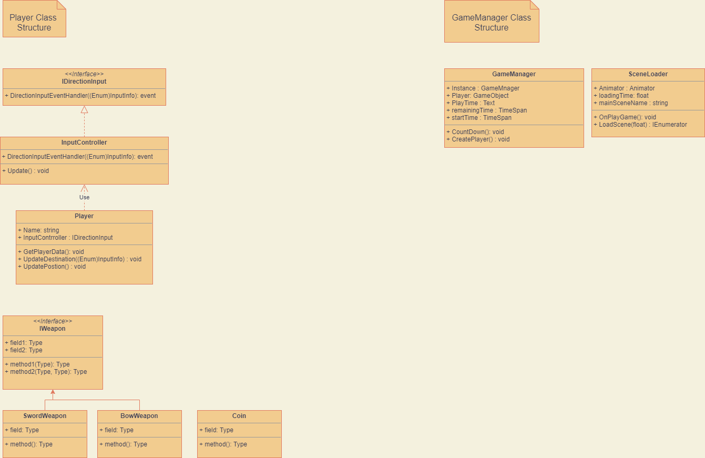

## Class Description
### ILivingEntity
살아있는 생물체의 부모 클래스
### Player
캐릭터의 속성과 메소드가 구현된 클래스
### Monster
몬스터의 속성과 메소드가 구현된 클래스
### NPC
캐릭터가 다가왔을 시 아이템 교환 및 도움말 안내
### IWeapon
모든 무기의 부모 클래스
### SwordWeapon
검의 속성과 메소드가 구현된 클래스
### BowWeapon
활의 속성과 메소드가 구현된 클래스
### Coin
몬스터를 처지할 시 드랍되는 코인의 속성값이 구현된 클래스
### GameManager
게임 전반에 대한 관리 기능을 하는 클래스